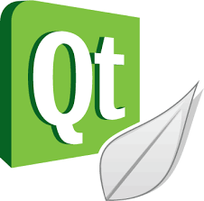

# Qt Course Examples and Tutorials

  

## 01: Hello, World!  

## 02: Hello, World!  

## 03: GUI-Programming  

## 04: SignalAndSlots  

## 05: DisplayingWindows 

## 06: Layout-Tabs-Buddies 

## 07: BasicApp-HTMLAwareWidgets 

## 08: HorizontalAndVerticalLayouts 

## 09: QGridLayout 

## 10: Splitters 

## 11: QDir

## 12: QFile

## 13: ResourceFiles

## 14: QLabelAndQtDesigner

## 15: QPushButton

## 16: QLineText

## 17: QCheckBox

## 18: QRadioButton

## 19: QComboBox

## 20: QListWidget

## 21-22: QTreeWidget

## 23: QActions

## 24: QSliderAndQProgressBar

## 25: QStatusBar

## 26: QMessageBox

## 27: QTimer

## 28: QThread

## 29: QThread "HighestPriority, NormalPriority and LowestPriority"

## 30: QThread with QMutex
